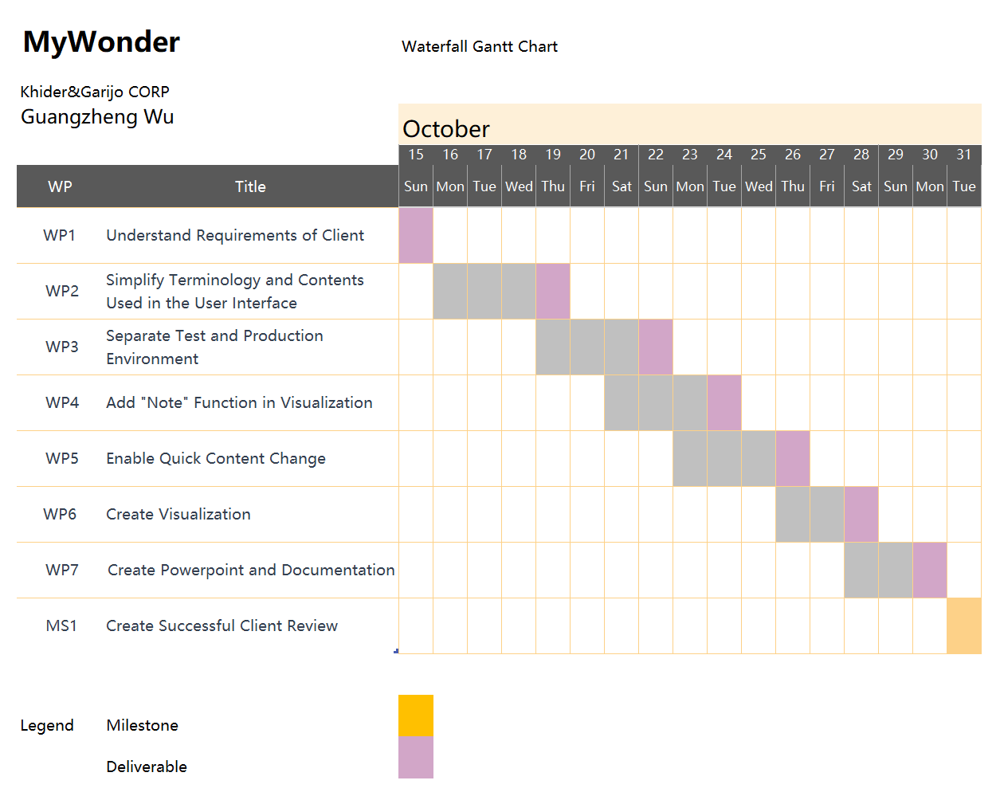
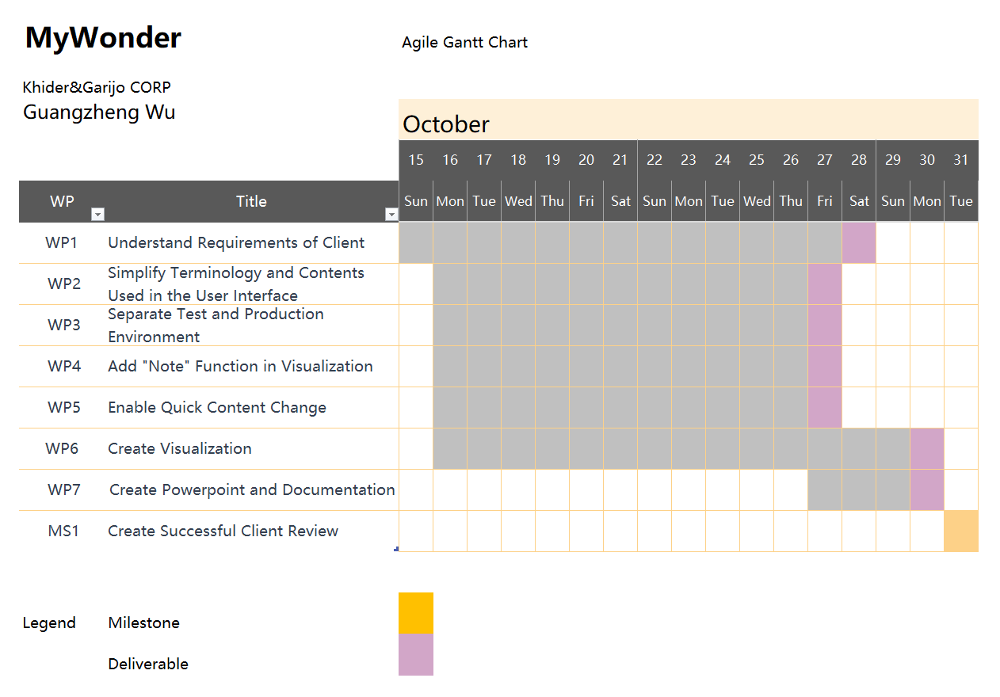

    

## Project Summary

MyWonder is a new platform for big data analytics and visualization. Our wish is to provide users with easy access to create visualizations from massive files within a small amount of time, instead of waiting for hours. Our approach is to distribute the files on the cloud efficiently. With our product, our users can calculate their analytics and summaries from their phones very easily.

## Waste

**Waiting:** There is something misleading, such as test contents, that makes one has to call our customer assistance team constantly, which takes time from my meetings with clients. 

**Motion:** If new functionailities are needed to be added, a great process step exists, where designers, developers and backend teams are all involved.

**Inventory:** Test environment is not separated with the production environment, where the test environment is unnecessary for most of the users.

## Deliverables:

- Understand Requirements of Client

- Simplify Terminology and Contents Used in the User Interface

- Separate Test and Production Environment 

- Add "Note" Function in Visualization

- Enable Quick Content Change

- Create Visualization

- Create Powerpoint and Documentation

## Milestone:

- Create Successful Client Review and Demos

## Gantt Chart:

    

    

